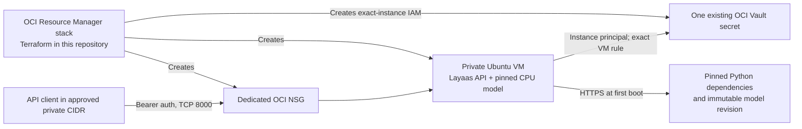

# Architecture

The deployment stack owns the compute instance, its NSG, an exact-instance
dynamic group and a policy limited to one secret OCID. It consumes a pre-existing
private subnet and Vault secret. It does not create a public IP, a public DNS name,
an SSH rule or an external edge service.

The secret value is fetched by instance principal at boot into root-only runtime
storage and exposed to the service through systemd credentials. Terraform and
cloud-init receive only its OCID. Model files are downloaded at the pinned commit
and cached on the VM; the API does not accept model selection from callers.

The public repository owns reusable application code, the stack package and
generic docs. The private production repository owns the running deployment's
resource configuration, owner procedures and live evidence. Production should
pin a tagged public release and record its commit; it must not deploy from a
moving default branch.
