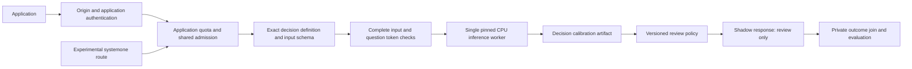

# Registered decisions: design and quality gates

Status: proposed implementation design, 2026-09-29. No registered-decision API,
calibration, application credentials, or quality approval is implemented by this
document. The existing release remains a shared inference runtime.

## Goal and first milestone

Keep one small CPU runtime while making each production decision an independently
owned, versioned, evaluated product. The first milestone is one **shadow-only
choice decision** alongside the application's existing process. It produces no
workflow side effects and never returns a top-level `action: act`.

Proposed development example: internal ticket routing, with `access`, `devices`,
`software`, and `other` labels. This is a synthetic example, not an approved
business taxonomy. Before representative data or application integration, its
owner must select the real workflow, approve labels and labelling guidance, name
the review destination, and approve data handling and error-cost criteria.

Success has two independent meanings:

- Engineering: the registered contract, exact token checks, caller identity,
  shared admission, evaluation pipeline and shadow integration work as specified.
- Product: a frozen candidate meets pre-agreed quality and review-capacity gates
  on representative held-out data. The engineering milestone can pass while the
  model is rejected for this workflow. No useful-quality claim follows from
  synthetic fixtures, repeatability, latency, or upstream benchmark results.

## Verified starting point

Public base: `2be952be024a2e46d7ba2b2b83a9d1ebc85baa49` / `v0.1.0`.
On 2026-09-29 the 42 local tests passed, and the release's
[Ubuntu CI](https://github.com/acedergren/layaas-oci/actions/runs/36549582092)
was successful. Neither check is a business-quality evaluation.

On the same date, the repository's dependency alerts reported seven open
Torch/Transformers advisories (three high, two medium, two low). This planning
review did not establish reachability or exploitability. Before the next release,
assess the exact locked versions and loaded execution paths, then record a
remediation or reviewed exception for each applicable advisory. If remediation
changes a pinned dependency, handle it as a separate prerequisite and repeat the
affected runtime/quality baselines; do not silently change the evaluation target.

`release.json` pins upstream `9d955671415fc19f069b9cc998928075c1f255ec`,
the multilingual model at `55cf4c4ebb4ebe31b2550e8bdf3bd21b99753851`, and
CPU execution. Limits are 32,768 body bytes, 8,000 state characters, 8 questions,
16 choice options, 10 score levels, 64 total options, 512 total tokens,
128 head tokens, 2 admitted requests, and 1 simultaneous model inference.

Current `server.py` wraps `laya.serve.create_app`. Upstream `_resolve_model`
normalizes unknown wire model names to no explicit selection; `FixedRouter`
then uses the pinned model. Its admission semaphore and executor belong to the
legacy route. A new route must not introduce a separate effective capacity limit.
Upstream returns rounded probabilities and reports some option collisions, but
does not expose a complete input-loss audit in the HTTP response.

## Boundaries

The public repository owns reusable code, synthetic fixtures, generic schemas,
evaluation tooling and packaging. Real decision definitions, application
permissions, credentials, labelled data, raw predictions, feedback and promotion
evidence belong in private deployment/configuration storage. A private repository
must not be treated as a safe place to commit customer records or secrets.

Keep `/v1/systemone` for experiments with its existing wire behavior. Keep health
and documentation authenticated. New application identities are required on the
registered route; the legacy origin bearer does not become an application ID.

Preserve the pinned dependency/model, CPU-only execution, resource defaults and
request limits. Exclude model training, model switching, larger context windows,
automatic summaries, browser UI, fraud/approval use cases, HA, additional VMs,
notifications and automated downstream actions from the first milestone.

## Request and response contract

Proposed route: `POST /v1/decisions/{decision_id}/evaluate`.

```json
{
  "decision_version": "1.0.0",
  "input": {"text": "My laptop screen is broken.", "language": "en"},
  "include_diagnostics": false
}
```

`decision_version` is mandatory and exact: no implicit latest version. A registry
definition fixes the input JSON Schema, supported languages, deterministic state
renderer, complete question wording, ordered answer labels, owner/reviewer,
checkpoint/revision, tokenizer identity and token budgets. A separate deployment
binding selects immutable calibration, policy and quality-attestation artifacts.
Definitions do not hash references to artifacts that themselves bind the definition:
this avoids a circular hash dependency. Definition changes require a new version;
calibration/policy updates produce a new binding hash and invalidate dependent
approval evidence without rewriting the definition or any existing artifact.

Reject extra input/envelope fields and caller-supplied questions, model names,
revisions, budgets, policy, application ID or thresholds with 422. Unknown
decision/version is 404; known but unauthorized is 403. Authentication failures
are 401, oversized bodies are 413, application quota exhaustion is 429 with
`Retry-After`, and global overload is 503 with `Retry-After`. Error details never
echo input or credential values. Infrastructure errors remain errors, not answers.

Example shape below is illustrative; a populated probability requires an accepted
calibration artifact. Hashes are shown as placeholders, never actual approvals.

```json
{
  "request_id": "server-generated-opaque-id",
  "application_id": "authenticated-application",
  "decision_id": "example.ticket-routing",
  "decision_version": "1.0.0",
  "mode": "shadow",
  "answer": "devices",
  "calibrated_probability": null,
  "calibration_status": "not_validated",
  "action": "review",
  "reason_codes": ["shadow_mode", "calibration_not_validated"],
  "input_integrity": {"complete": true, "state_tokens": 9, "state_budget": 350},
  "versions": {
    "definition": "sha256:<digest>",
    "binding": "sha256:<digest>",
    "runtime": "<release-commit>",
    "model": "55cf4c4ebb4ebe31b2550e8bdf3bd21b99753851",
    "tokenizer": "<model-revision>",
    "calibration": null,
    "policy": "sha256:<digest>"
  }
}
```

For lost input tokens: HTTP 200, `answer: null`, null probability, `action: review`,
`reason_codes` including `input_truncated`, and **no model forward pass**. Unsupported
but valid language yields the same abstention shape with `unsupported_language`.
Unknown languages are outside validation; the language field alone is not proof
of language or domain membership. Mandatory `other` and ambiguous cases are
review-only for the proposed example. Definition errors that truncate instructions
or answers, or collapse distinct options, fail registry startup validation.

For intact inputs without calibration, inference may return a candidate label for
shadow comparison; its probability is not called calibrated. Low confidence under
a validated policy adds `low_confidence`. `include_diagnostics` needs a separate
permission and returns bounded raw model output explicitly marked uncalibrated;
it is not a factual explanation. Missing/invalid results fail closed. Policy never
uses upstream entropy `confidence` or the learned `act_probability` as approval.

## Minimal architecture



- Use a filesystem registry of validated JSON definitions, loaded atomically at
  process start, not a registry database or administrative HTTP API. Production
  definitions mount separately from the public synthetic example. Missing or
  mismatched definitions/artifacts fail readiness; no silent sample fallback.
  A fit's validation status comes from a separate acceptance attestation bound to
  the frozen final report and artifact hashes; an artifact cannot approve itself.
- One shared runtime executor owns inference for both routes. A shared admission
  gate bounds their combined outstanding requests to two, before body reads.
  Hold admission until real work finishes even after client cancellation. The
  legacy upstream executor may remain a dispatcher; it must not forward directly
  around the shared worker. Preserve lifespan draining and responsive health.
- Isolate the pinned upstream integration in one adapter. Extract unrounded
  logits using the pinned agent's encode/collate/forward path with inference mode,
  proving parity against the original prediction path. Do not recover logits
  from rounded HTTP probabilities or mutate the shared agent's temperatures per
  request. If parity cannot be proved, the calibration milestone is blocked.
- Token inspection uses the **loaded tokenizer** and exact serialized sequence:
  instructions, option text, marker/special tokens and state, including the
  upstream 48-token option cap and head allocation. Check 511/512/513 assembled
  token boundaries and partial state loss, even when state is below 8,000 chars.
  Reject definitions that lose any instruction/option text. Test against the
  pinned `build_sequence`; no character-to-token heuristics.
  If model preprocessing would remove a literal mask token from the input,
  return review with `input_normalized` instead of silently discarding it.

## Application identity and isolation

Retain origin bearer protection. Registered calls additionally supply
`X-Layaas-Application-Key`, a distinct random credential per application.
Derive identity from a protected credential-to-application mapping, never from a
caller-declared name or unverified forwarded header. Duplicate identity headers,
unknown keys, revoked mappings and cross-application decision access fail closed.
External identity services may add protection without changing this contract.

Use one optional, separately scoped Vault secret holding the application
credential mapping; only its OCID may enter Terraform or cloud-init. Store
credential digests and application permissions in protected runtime storage via
systemd credentials. Key creation/delivery stays in the deployment owner's secret
workflow. Validate mapping shape before enabling the route. Keep legacy-only
deployments valid when the registry is disabled. Revocation/rotation takes effect
after a documented process restart; test that the prior key is denied afterward.

An application policy allows explicit decision/version pairs, diagnostics access,
requests per minute, burst and concurrent requests. Enforce a monotonic token
bucket and per-application admission under the combined global cap. Counters are
in memory and reset on restart; this is not billing-grade or distributed quota.

## Evaluation, calibration and decision gates

The pinned [upstream evaluation harness](https://github.com/NandhaKishorM/laya/blob/9d955671415fc19f069b9cc998928075c1f255ec/docs/evals.md)
can supply dataset validation, accuracy and calibration metrics. Wrap it so runs
use the registered definition, actual loaded revision and the same 512/128 token
limits as serving. Its bare CLI defaults are not the deployed preprocessing path.
Extend reports with abstention, cost and input-integrity measures.

The [upstream limitations](https://github.com/NandhaKishorM/laya/blob/9d955671415fc19f069b9cc998928075c1f255ec/README.md#honest-limits)
and [calibration discussion](https://github.com/NandhaKishorM/laya/blob/9d955671415fc19f069b9cc998928075c1f255ec/README.md#calibration)
are reasons to measure this workflow; their benchmark values do not establish
accuracy or a safe threshold for it. A supported evaluation process also records
limits and repeat measurement as described by the [NIST Measure playbook](https://airc.nist.gov/airmf-resources/playbook/measure/).

1. **Owner contract before data use.** Record intended population, prohibited
   uses, owner and reviewer, ordered labels, ambiguity policy, asymmetric error
   costs including human review, maximum accepted error bound/cost, minimum
   coverage, review capacity, required language slices, retention and minimum
   evidence per slice. Unset fields block promotion; no default 0.99 threshold.
2. **Label and split before tuning.** Use development, temperature-calibration,
   policy-selection and untouched final-test partitions. Group each underlying
   ticket, paraphrase and translation into one partition; keep time ordering where
   feasible. Label without seeing model or current-route predictions, adjudicate
   disagreements, and mark genuinely ambiguous records `must_review`. Retain
   provenance/consent and dataset/split digests privately. Public synthetic cases
   test mechanics only and cannot populate promotion evidence.
3. **Representative and challenge evidence.** Measure a naturally sampled final
   population plus a separately reported challenge suite: Swedish/English,
   negation, ambiguity, costly mistakes, unsupported inputs, option-wording
   changes and evidence at the end of long text. Challenge variants never inflate
   the independent sample count or measured production coverage. Wording changes
   are new candidate definitions, not caller-controlled options.
4. **Simple baseline and frozen candidate.** Build deterministic rules on the
   development partition, with explicit review on ties/no-match; also report a
   majority-class reference. Compare current routing where labels permit. Fit one
   positive temperature per choice decision on full-precision logits from the
   calibration partition using NLL. Measure NLL, multiclass Brier, ECE/reliability
   bins and per-language metrics with counts; one temperature may not suffice.
   Only mark an artifact validated after the held-out evaluation passes. A
   provisional fit is restricted to offline policy analysis.
5. **Choose policy without touching final test.** On the policy partition sweep
   thresholds over the calibrated top-label probability. Minimize expected error
   plus review cost subject to the owner's coverage, error and reviewer-capacity
   limits. Report the whole risk/coverage curve; no eligible threshold means
   insufficient evidence. The reserved `other` label and ambiguity remain review.
6. **Final gate.** Freeze definition, preprocessing, model, calibration and policy
   hashes, then run once on untouched final data. Report overall and slice-level
   confusion/error, coverage, selective error, total cost per case, review load,
   Brier/NLL/ECE, integrity rejections, inference errors and latency. Use one-sided
   95% binomial error bounds on independent accepted cases; predeclare the family
   of required slice gates and adjust its confidence budget for multiplicity.
   Use paired, group-aware cost intervals against the baseline. Small or missing
   slices, nonfinite metrics, no accepted cases, hash mismatch, leakage, failed
   required gates or synthetic-only evidence block promotion. Never report zero
   error for an empty denominator. A failed final test requires a new candidate
   and fresh untouched confirmation data, not threshold tuning on the failed set.

If rules/current routing are better within the owner's cost criteria, keep that
process and do not promote Laya. A future specialized checkpoint, changed context
or summary strategy requires a new candidate and the same gates; training is a
separate future project. Neither success nor failure is predetermined.

## Shadow feedback and later promotion

The application records the generated request ID against its existing workflow
and joins delayed reviewer/outcome labels in approved private storage. Start with
an offline JSONL export and report command, not a feedback service or database.
Evaluate outcomes across **all** sampled shadow cases, not only easy or manually
reviewed predictions. Report missing/delayed labels and selection bias.

Log bounded application/decision IDs, immutable version hashes, request IDs,
action/reason codes, timing and status only. Keep text, identifiers from source
tickets, request bodies, secrets and raw model output out of journald, CI logs and
public artifacts. Retention/access must be approved before real records enter the
shadow flow. An owner-generated report tracks slices, coverage, error cost,
unsupported/truncated inputs, quotas and overload; no notification integration.

Initial implementation recognizes **only shadow policies** and rejects `act`
mode at startup. Subsequent automation is a separately reviewed change requiring
accepted independent test results, adequate shadow outcomes, review capacity and
owner approval of exact artifact hashes. Even then, `act` is a policy
recommendation; the application owns permission and execution of any action.
Changing input populations or any bound artifact triggers re-evaluation. Return
to shadow on missing evidence, breached cost/slice gates or insufficient labels.

## Completion and rollout boundary

The first implementation is complete when a registered synthetic example proves
the full contract, fail-closed cases, shared capacity, offline evaluation and
shadow-feedback join; an approved real workflow then supplies quality evidence.
Report these two statuses separately. Public CI must not claim a product gate
passed because a synthetic contract fixture passed.

Ship reusable source and stack packaging first. The private deployment consumes
an exact tagged public commit/artifact and records it separately from edge and
infrastructure configuration. Existing live acceptance remains historical service
evidence. Plan a new scoped rollout and recovery check before any deployment;
this document authorizes neither cloud mutation nor automatic actions.
